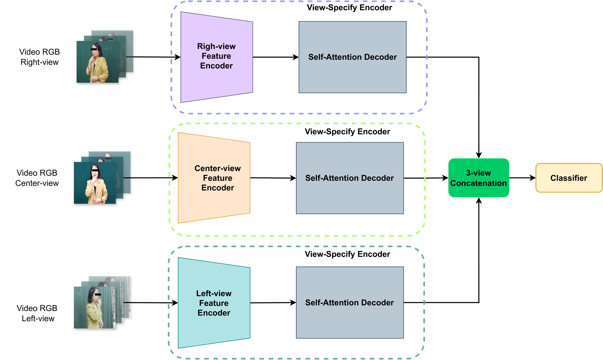
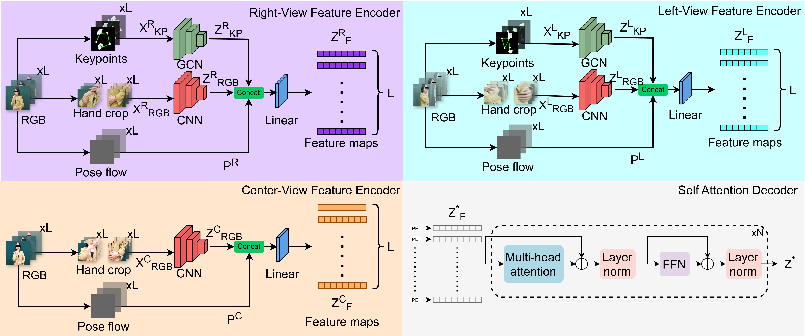

# VTN3GCN
## Introduction


Most existing SLR datasets provide only frontal viewpoints, which constrains the model's generalizability, particularly in real-world settings where diverse perspectives are prevalent, so we propose VTN3GCN, a multi-view and multi-stream framework that integrates RGB data, skeleton coordinates, and pose flow from three distinct viewpoints: left, right, and center. 



## Data
Multi-VSL dataset was collected in collaboration with 28 volunteers, including both teachers and hearing-impaired students from Hanoi School for the Deaf. The dataset comprises 18,981 videos, each video captures a volunteer performing a single gloss from one of three distinct viewpoints: left (~45°), center (~0°), and right (~45°), to ensure high representativeness.
- Link Dataset: [Link](https://drive.google.com/drive/folders/1yUU1m2hy_CjaXDDoR_6i9Y3T1XL2pD4C)
- Data labels in folder [data](https://github.com/fossbk/MultiView-ISLR/tree/main/VTN3GCN/data)

## SOTA comparision
 Method               | Top-1 Accuracy (%) | Improve | Top-5 Accuracy (%) | Improve |
|---------------------|---------------------|---------|---------------------|---------|
| I3D (1-view)        | 56.62 ± 0.0055      | 36.30   | 83.99 ± 0.0063      | 14.26   |
| I3D (3-view)        | 66.35 ± 0.0066      | 26.57   | 90.14 ± 0.0050      | 8.11    |
| Swin Trans (1-view) | 77.29 ± 0.0083      | 15.63   | 91.81 ± 0.0064      | 6.44    |
| Swin Trans (3-view) | 82.33 ± 0.0034      | 10.59   | 94.03 ± 0.0032      | 4.22    |
| MViTv2 (1-view)     | 81.57 ± 0.0038      | 11.35   | 92.36 ± 0.0029      | 5.89    |
| MViTv2 (3-view)     | 86.45 ± 0.0026      | 6.47    | 95.55 ± 0.0031      | 2.70    |
| VTN (1-view)        | 81.64 ± 0.0052      | 11.28   | 92.29 ± 0.0037      | 5.96    |
| VTN (3-view)        | 87.99 ± 0.0051      | 4.93    | 95.50 ± 0.0017      | 2.75    |
| VTN3GCN [checkpoint](https://drive.google.com/drive/folders/12dScaCjePvTyxvlWElGVTYv12UFcHN9U?usp=drive_link)      | 92.92 ± 0.0009      | -       | 98.25 ± 0.0011      | -       |

## Usage
### Package
Packages could be installed by:
```
pip install -r requirements.txt
```
### Training
- VTNGCN:
```
python3 main.py --config configs/VTNGCN_autsl_to_vn_sign.yaml
```
- VTN3GCN:
```
python3 main.py --config configs/VTN3GCN_finetune_from_one_view.yaml
```
### Testing
- VTNGCN:
```
python3 main.py --config configs/test_cfg/VTNGCN_autsl_to_vn_sign.yaml
```
- VTN3GCN:
```
python3 main.py --config configs//test_cfgVTN3GCN_finetune_from_one_view.yaml
```
### Folders usage
- AAGCN: AGCN architecture
- configs: config files for I3D, Swin Video Transformer, Video Transformer, MViTv2, VTNGCN, VTN3GCN.
- data: labels folder
- dataset: contains dataloader for models
- images: model firgure
- modeling: contains architecture models: I3D, Swin Video Transformer, Video Transformer, MViTv2, VTNGCN, VTN3GCN and 3-view variants of them.
- tools: Hand Crop and Pose Flow preparation codes for VTN, VTNGCN and VTN3GCN
- trainer: contains code for training and testing
- utils: augmentation and config reader
