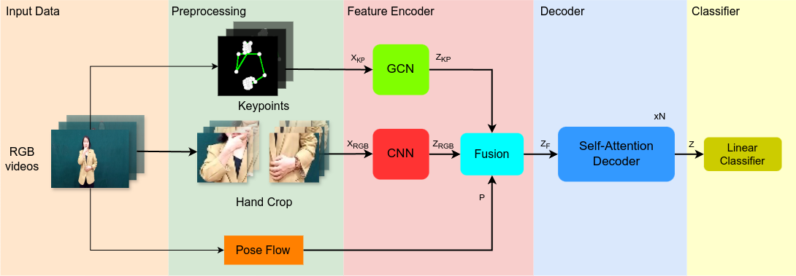

# VTNGCN
## Introduction


In this study, we propose a two-stream VTNGCN model that enhances video understanding for sign language recognition by integrating RGB frame data with keypoint coordinates from multi-view data, achieving superior performance compared to the original Video Transformer Networks model.

## Data
Multi-VSL dataset was collected in collaboration with 28 volunteers, including both teachers and hearing-impaired students from Hanoi School for the Deaf. The dataset comprises 18,981 videos, each video captures a volunteer performing a single gloss from one of three distinct viewpoints: left (~45°), center (~0°), and right (~45°), to ensure high representativeness.
- Link Dataset: [Link](https://drive.google.com/drive/folders/1yUU1m2hy_CjaXDDoR_6i9Y3T1XL2pD4C)
- Data labels in folder [data](https://github.com/fossbk/MultiView-ISLR/tree/main/VTN3GCN/data)

## Usage
### Package
Packages could be installed by:
```
pip install -r requirements.txt
```
### Training
- VTNGCN:
```
python3 main.py --config configs/VTNGCN/VTNGCN_autsl_to_vn_sign.yaml
```
### Testing
- VTNGCN:
```
python3 main.py --config configs/VTNGCN/test_cfg/VTNGCN_autsl_to_vn_sign.yaml
```
### Folders usage
- AAGCN: AGCN architecture
- configs: config files for VTNGCN.
- data: labels folder
- dataset: contains dataloader for models
- images: model firgure
- modeling: contains architecture of VTNGCN.
- tools: Hand Crop and Pose Flow preparation code
- trainer: contains code for training and testing
- utils: augmentation and config reader
